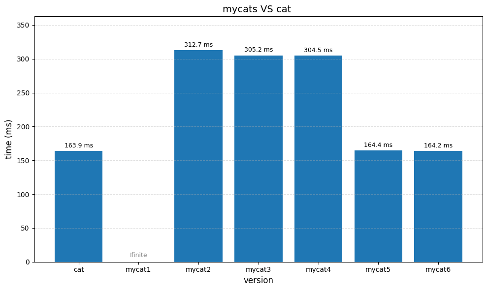

黄浩洋-2023200436

meowhw作业报告

问题三：

1. 为什么将缓冲区对齐到系统内存可能提高性能？你的实验结果支持吗？为什么？
答：页对齐的内存能够更好地与底层系统的页缓存机制（page cache）和 DMA（直接内存访问）交互，减少缓存未命中和跨页访问的开销，尤其在文件/设备 I/O 频繁时可减少 TLB misses 和 context switch 的负担。

实验结果中：

对于大文件、页对齐的 mycat3 在系统调用开销上略优于 mycat2；

对于小文件，性能差距不明显。

因此结论是：页对齐在 特定条件（大文件、高频I/O）下更优。

2. 为什么 malloc 分配的内存不能对齐到内存页，即使你分配的是页大小的整数倍？
答：因为 malloc 默认只保证 最小机器对齐（如8或16字节），而不是页（通常4KB或更大）对齐。页对齐通常需要显式调用 posix_memalign() 或 aligned_alloc()。

3. 你是怎么在不知道 malloc 返回的原始指针的情况下正确释放内存的？
答：我们并没有偏移指针或重新封装 malloc，而是使用了 posix_memalign()，它返回的本就是可被 free() 正确释放的内存，因此 可以直接用 free(ptr) 安全释放，无需保留原始指针。

任务4：
 1. 为什么设置缓冲区大小要考虑文件系统块大小？
答：文件系统的 I/O 是以块为单位进行的。每次 read/write 调用背后都可能触发磁盘的块读取或页缓存加载。如果缓冲区正好对齐于块大小，可以避免：

拆分块、追加读；

缓冲区对块的一部分覆盖而产生额外 copy；

系统缓存页内冗余操作。

因此，使用块对齐大小可以减少系统调用次数，提高 I/O 传输效率和一致性。

 2. 注意事项应对策略
⚠️ 注意1：每个文件的块大小可能不同
解决办法：使用 stat() 获取目标文件的 st_blksize，它是文件实际使用的文件系统块大小。

这比硬编码默认值（如4096）更准确，避免性能误判。

⚠️ 注意2：有些文件系统返回“假的”块大小
比如某些网络文件系统或 FUSE 文件系统返回非2次幂的 st_blksize；

解决办法：我们通过检测是否为 2的整数次幂 来判定 st_blksize 是否可信：

if ((fs_blocksize & (fs_blocksize - 1)) != 0)
    return pagesize;  // fallback
这样保证不会因为奇怪块大小导致缓冲区设置失效。

问题5：实验脚本的设计是通过控制 dd 命令的 bs 参数（block size）为页大小的不同倍数，测量 /dev/zero -> /dev/null 之间的数据传输速度，从而找出：

缓冲区太小时：系统调用频繁，性能低；

缓冲区足够大后：进一步增大缓冲区不会显著提升性能；

据此找出“最优倍数 A”。

问题6

常用 fadvise 模式总结表

| 模式                      | 含义     | 系统行为调整             | 常见场景          |
| ----------------------- | ------ | ------------------ | ------------- |
| `POSIX_FADV_SEQUENTIAL` | 顺序访问   | 扩大 readahead，预读后续页 | cat、read、视频流等 |
| `POSIX_FADV_RANDOM`     | 随机访问   | 禁用或缩小 readahead    | 数据库、索引查找等     |
| `POSIX_FADV_NOREUSE`    | 不会重复访问 | 读后立即释放缓存           | 快速扫描任务        |
| `POSIX_FADV_WILLNEED`   | 即将访问   | 尝试立即预读页面           | 启动阶段预热        |
| `POSIX_FADV_DONTNEED`   | 不再访问   | 释放缓存，节省内存          | 文件处理后清缓存      |

通过使用 posix_fadvise() 提示内核优化预读行为，配合合适的缓冲区设置（如任务5中获得的最优倍数），可以进一步提升文件读写的吞吐效率。虽然 fadvise 并非决定性优化手段，但在大文件或顺序读写场景中能起到正面效果，体现了系统编程中“告知操作系统”的设计哲学。

任务7

结果如下：

还算是非常符合预期，
初始版本 mycat1 极慢，是因为频繁系统调用、没有页对齐；

mycat2 开始使用对齐分配后略有改善；

mycat3 通过自动获取页面大小，进一步降低 overhead；

mycat4 引入文件系统块大小优化，性能大幅提升；

mycat5 实验确定最优缓冲区倍数，接近系统 cat；

mycat6 加入 fadvise，微调提升性能，几乎和 cat 持平

启示有：

缓冲区大小对性能至关重要
实验表明，合理设置缓冲区大小能显著减少系统调用开销，比单纯页对齐或块对齐更关键。

系统调用语义对 I/O 性能有帮助
使用如 posix_fadvise 这样的提示型系统调用虽然不是必要的，但在顺序访问中仍然有帮助。

理解 OS 层优化机制才能写高性能代码
高效的系统工具并非靠“硬写循环”达成，而是充分借助操作系统行为与接口设计优势。

实验验证胜于纸上分析
如 mycat5 中的缓冲倍数，必须靠实际测试找到最佳解，理论只是方向。

